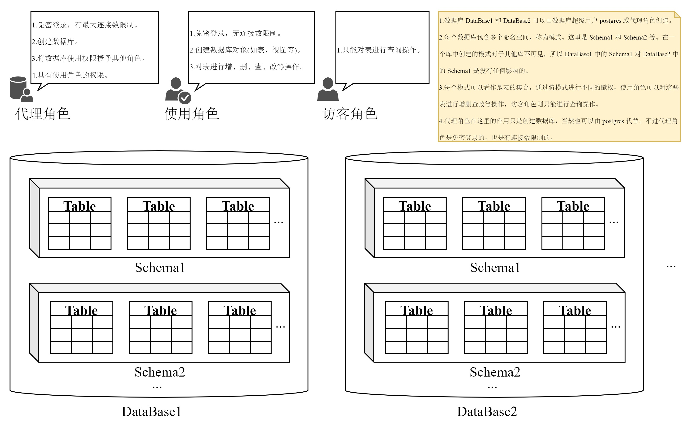

应该避免使用数据库超级用户(一般是 postgres)权限登录。对使用 postgres 登录应该加以限制，这里使用密码进行登录限制。同时创建一些角色，分别承担 postgres 的一些作用，如创建角色、创建数据库及数据库对象、流复制等。

除了 `postgres` 之外，这里还会使用两种权限角色来对数据库进行日常的管理。分别是 `pguser` 和 `guest`。关于几种角色的说明如下:

|  角色名称 | 登录限制 | 连接数限制    | 功能 |
|:---------|:--------|:--------------|:-----|
| postgres | 密码登录 | 无限制        | 数据库超级用户 |
| pguser   | 免密登录 | 无限制        | 进行创建数据库对象(如表、序列、索引等)、进行增删查改等操作 |
| guest    | 免密登录 | 无限制        | 作为访客，只能进行查询操作 |

注: 可能也不会有太多次创建数据库的机会，所以代理角色在这里省略了。
